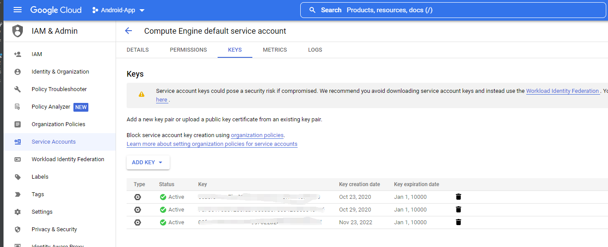

# play-integrity-api-java
Play Integrity Api的后端代码示例，见Main.java
起因是谷歌要求从SafetyNet API迁移至Play Integrity API
Android端代码见https://github.com/HairySnow/play-integrity-api-android
需要app端传递的参数有：
//app端调用Play Integrity API获取到的integrityToken
String integrityToken = "<your integrity token from app>";
//应用名
String applicationName = "<your application name>";
//应用包名
String packageName = "<your packageName>";
//从谷歌控制台获取到的授权JSON文件
String credentialJsonPath = "<your credential json from google cloud platform>";
在Google Cloud 中选中自己创建的特定的项目如图的(没有需要自己创建，图中是Android-App)
然后到Service Accounts下，点击右边的ADD KEY按钮创建新key，完成之后会有一份JSON文件

